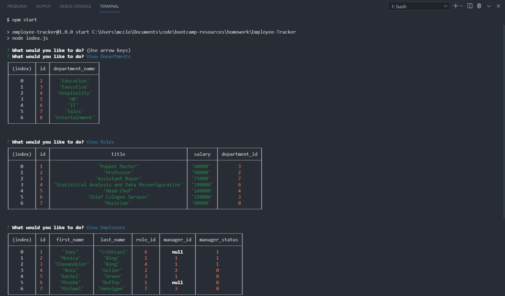

# Employee-Tracker

## This GitHub repository contains the code and database schema for an Employee Tracker application.

---

### This application allows for a user to manage their employees within a database, allowing the user to organise their employees into departments, roles and define managers for each employee. The application is interactive, driven by a command line interface while the data is stored in a MySQL database, allowing for future retrieval and modification of the data. The ultimate goal is to allow the user to manage their business users by creating a rudimentary CMS.

---

## Table of Contents

* [Motivation and Research](#motivation-and-research)
* [Development](#development)
  * [Web development technologies](#web-development-technologies)
  * [Challenges](#challenges)
* [Future Development Opportunities](#future-development-opportunities)
* [Deployed Application Link:](#deployed-application-link)
* [Repository Link:](#repository-link)
* [Application Screenshots:](#application-screenshots)

---

## Motivation and Research

The motivation behind this project was to begin to work the concepts of developing and maintaining a Content Management Systems (CMS). 

The application is designed to prompt the user to perform various activities around the data management of departments, roles and employees; this includes viewing, adding or updating the users assigned roles or managers, adding new departments to assign employees to and deleting departments.

The application is command line driven, and simple to use, allowing for data to be quickly added to the database, or for user records to be updated as dictated by business requirements. It provides a functional CMS for the storing of employee data, allowing a user to quickly add users to the database or assign them a defined role.

Developing and maintaing CMS platforms is a core developer activity, as is supplying an interface to interact and manipulate the data, so that end users are able to utilise the application to store data that is relevant to the applications use.

Using a supplied example database schema, this schema was expanded on and used as the basis for creating a MySQL based database platform for storing the data used by the application.

---

## Development

### Web development technologies

Development of the project was centered around using Inquirer, a back end web application for Node.js that is installed using the node package manager (NPM), and MySQL.

Inquirer is an NPM package that provides an easy way to capture user input in your Node. js command line interface applications.

Node.js, an open-source, cross-platform, back-end JavaScript runtime environment that runs on the V8 engine and executes JavaScript code outside a web browser.

MySQL is an open-source relational database management system.
 
Links to the languges and tools used to build this project are included below:

* Javascript ES6
* Node.js
    * https://nodejs.org/
* MySQL
    * https://www.mysql.com/
* NPM
    * https://www.npmjs.com/
* NPM Packages
    * Dotenv
        * https://www.npmjs.com/package/dotenv
    * Inquirer
        * https://www.npmjs.com/package/inquirer
    * MySQL2
        * https://www.npmjs.com/package/mysql2

### Challenges

The development of this application required the use of MySQL, Node.js and several NPM packages, including the installation of Dotenv, Inquirer and MySQL2.
Usind MySQL to develop a working database schema and functions that successfully mainpulated the database was also new for me. The syntax required for MySQL to function properly is very specific and I had to ensure all functions to create or edit the database were syntactically correct to avoid errors.
These were new technologies for me as a web developer and required testing and research to understand these tools in order to implement them to create a working project for other users.

## Future Development Opportunities

Future development opportunities for the application can be focused on both the back end database and ther user interface used to run the application.

Providing a web based interface for the addition, change or viewing of employees, roles and departments would provide a superior experience for the end user accessing the application, as the data could be formatted and displayed in a way that provides access to the most relevant data first, in a way which is asthetically pleasing to the user.

By providing a web based interface, the data that is captured by the application for storage within the CMS could also be expanded, allowing for the storage of additional employee details, such as their home address, or payroll information.  This would require additional tables and indexes to be created within the MySQL database, but would provide additional value by having a richer data set.

Using a user interface could also allow for the display of a users reporting lines or organisational structure, by utilising data such as manager or department to display the relationships between the data.

Building a security model into the application would allow for certain database fields to be marked as protected information, allowing a user to access a sub set of the available data, depending on their role.  As the application may end up storing Personally Identifiable Information (PII) this should be explored as a priority.

Finally, applying a more consistent branding experience to the resulting UI that is aligned to my other applications is also planned, reflecting my professional brand and providing a consistent UI experience across all of my developed applications.

---

**Thank you for visiting.**

---

### Repository Link:

* https://github.com/blmccavanagh/Employee-Tracker

---

### Application Screenshots:

*Employee Tracker questions asked in the terminal*

---

*Employee Tracker walkthrough video*

<a href="https://drive.google.com/file/d/1-UlyNw31cYbMXfz3O-VtWlsBtHNfwZqI/view?usp=sharing">Click here to watch the video!</a>

---